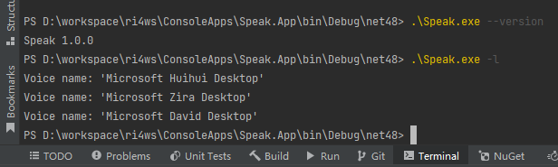

# App05.Speak

实现支持命令行参数的Console App.

```shell
  -l, --list      Get list available voices.

  -i, --info      Get detailed information about voice.

  -t, --text      Text to speak.

  -v, --voice     Select voice.

  -h, --volume    (Default: 100) Set voice volume. Values: [0; 100].

  -r, --rate      (Default: 0) Set voice rate. Values: [-10; 10].

  --help          Display this help screen.

  --version       Display version information.
```


