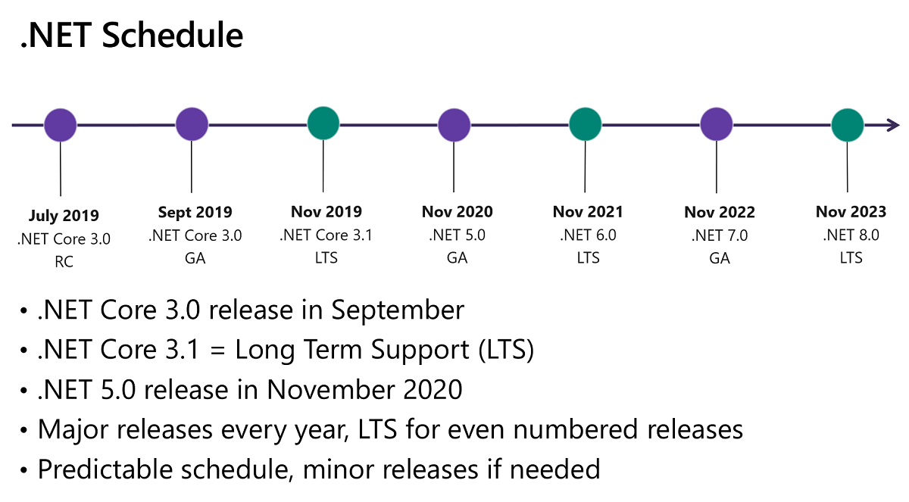

# [ConsoleApps](https://github.com/zhongwcool/ConsoleApps)
项目的目标框架是.NET 6，运行本项目你最好需要先安装[.NET 6 SDK](https://dotnet.microsoft.com/download/dotnet/6.0) 。

本项目支持c#9开始引入的top-level statements，同时也仍然兼容Main入口模式。

The typical starting point for a new console application looks like the following code:
```c#
using System;

namespace Application
{
    class Program
    {
        static void Main(string[] args)
        {
            Console.WriteLine("Hello World!");
        }
    }
}
```
The C# templates for .NET 6 use top-level statements:
```c#
// See https://aka.ms/new-console-template for more information
Console.WriteLine("Hello, World!");
```

## .NET开发路线图

